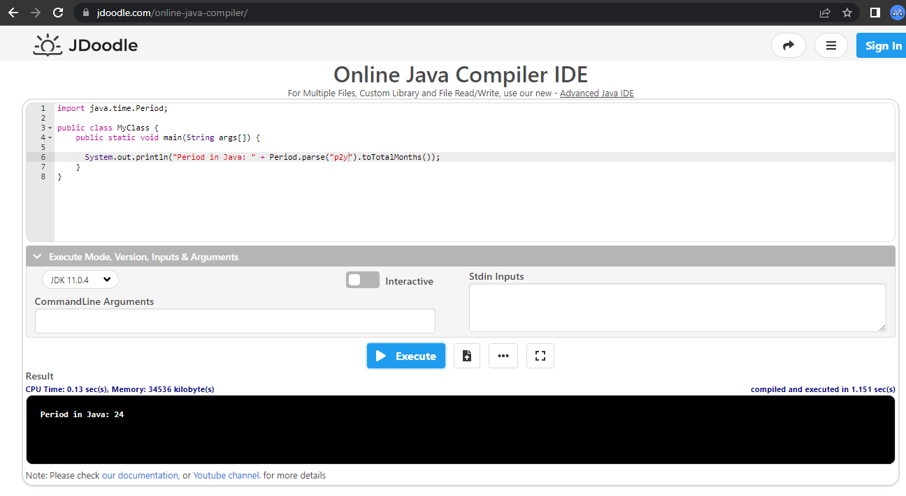

># Development Based on Defined Agreements - by Valentine Wu
>
>For software development, it is normally to first **define** the requirements which are **agreed** by the stakeholders based on which the implementation will start. The defined agreement is evolving from time to time and its implementation will be moving forward accordingly. 
>
>## Defined and Agreed Requirements
>
>From business analysts, we have the business requirements. From architect resources, we have the matching technical requirements with consideration of other high-level technical standards and compliances (which should be set up gradually as important team and organization assets).
>
>For the incoming requirements, development resources should:
>
>1. make sure that they are **defined** - in writing, quantified, testable, objective;
>
>2. check with the architect resources on the understanding to achieve the **agreed** requirements. Don’t assume that the understanding on the requirements from the development resources matches the requirements from architect resources automatically.
>
>After the understanding of the requirements gets confirmed and approved by the architect resources in writing, the development resources should implement only on the **defined** and **agreed** requirements.
>
>Any new or different things from the **defined** and **agreed** requirements should be separated as a new task to be prioritized by the project manager.
>
>All the above in writing should be recorded in one or more tickets before any code update starts based on those tickets. This may require some efforts to put all agreements from discussions and meetings to be added in the ticket(s) to capture the whole picture of the **defined** and **agreed** requirements.
>
>Architect resources take the leading role to make sure development resources have the clear and clean scope - it is like the law maker to define the rules, standards, etc. 
>
>It is development resource’s responsibility to ask for and help achieve the **defined** and **agreed** requirements.
>
>## Code Review - White Box Checking
>
>Code reviewers do the code review based on the understanding of the requirements, which is recorded in the ticket, from the developer who requests the code review.
>
>The purpose is to find any discrepancies between what is said in plain English (**defined** & **agreed** requirements) and what is coded in Java.
>
>Code reviewers are like doing the law enforcement within the box.
>
>## Testing - Black Box Checking
>
>Testers prepare the test cases and test data, and execute the test cases based on the **defined** and **agreed** requirements.
>
>It is not expected for testers to look into the code to understand the requirements.
>
>The purpose is to find any discrepancies between what is expected and what is actually got from the execution of those test cases.
>
>Testers are like doing the law enforcement out of the box.

# spring-boot-period-style-iso8601
Demonstrate the [pull request #32235 of Spring Boot, version 2.7.3 with JDK 11](https://github.com/spring-projects/spring-boot/pull/32235) I created on September 5, 2022

# Steps to Demonstrate the Issue in #32235
1. Git clone the source code;
2. Type `mvnw.cmd clean package` in the project directory from Windows command line and you will get `BUILD FAILURE` due to the following error:

    `[ERROR] Tests run: 1, Failures: 0, Errors: 1, Skipped: 0, Time elapsed: 1.839 s <<< FAILURE! - in ca.enjoyit.mavenspringbootapp.MavenSpringBootAppApplicationTests`
    
    `[ERROR] contextLoads  Time elapsed: 0.008 s  <<< ERROR!`
    
    `java.lang.IllegalStateException: Failed to load ApplicationContext`
    
    `Caused by: org.springframework.beans.factory.UnsatisfiedDependencyException: Error creating bean with name 'controller': Unsatisfied dependency expressed through field 'period'; nested exception is org.springframework.beans.TypeMismatchException: Failed to convert value of type 'java.lang.String' to required type 'java.time.Period'; nested exception is org.springframework.core.convert.ConversionFailedException: Failed to convert from type [java.lang.String] to type [@org.springframework.beans.factory.annotation.Value java.time.Period] for value 'p2y'; nested exception is java.lang.IllegalArgumentException: 'p2y' is not a valid period`
    
    `Caused by: org.springframework.beans.TypeMismatchException: Failed to convert value of type 'java.lang.String' to required type 'java.time.Period'; nested exception is org.springframework.core.convert.ConversionFailedException: Failed to convert from type [java.lang.String] to type [@org.springframework.beans.factory.annotation.Value java.time.Period] for value 'p2y'; nested exception is java.lang.IllegalArgumentException: 'p2y' is not a valid period`
    
    `Caused by: org.springframework.core.convert.ConversionFailedException: Failed to convert from type [java.lang.String] to type [@org.springframework.beans.factory.annotation.Value java.time.Period] for value 'p2y'; nested exception is java.lang.IllegalArgumentException: 'p2y' is not a valid period`
    
    `Caused by: java.lang.IllegalArgumentException: 'p2y' is not a valid period `

# Behavior in Java for the Same Use Case
`Period.parse("p2y").toTotalMonths()` will return `24` in Java code:

